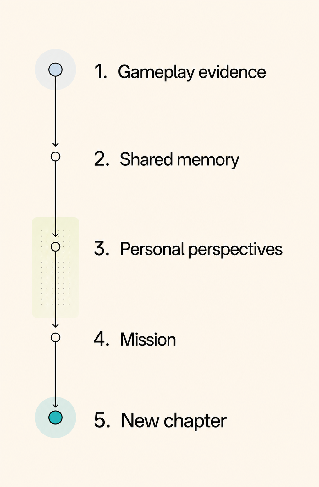

# MemoryOS — Garena Next Chapter

[](https://github.com/yumwoonsen/MemoryOS/actions/workflows/backend-ci.yml)
[](https://github.com/yumwoonsen/MemoryOS/actions/workflows/frontend-ci.yml)
[](pyproject.toml)
[](LICENSE)

MemoryOS is an AI-first prototype that turns trusted squad-game telemetry into an evidence-grounded
shared memory and a playable **Next Chapter** mission. It powers the mobile-first Garena Next Chapter
player experience and a Developer Studio that makes the AI, evidence, validation, and delivery path
inspectable.

> [!IMPORTANT]
> MemoryOS is a hackathon prototype built with synthetic fixtures. It does not connect to Garena or
> Free Fire production services, contain real player data, or claim access to internal APIs.



## Why MemoryOS

Match records and statistics describe performance, but players often remember the rescue, failed
plan, comeback, or squad joke around a match. MemoryOS converts those grounded episodes into a
specific reason for the squad to reconnect.

The prototype demonstrates:

- **Telemetry-first memory discovery:** deterministic preparation normalizes events, applies
  consent, and creates eligible chronological windows.
- **AI-authored interpretation:** a configured model selects an offered episode-and-mission
  combination and writes the title, teaser, memory, player perspectives, and story bridge.
- **Evidence-backed delivery:** deterministic validators check identities, event references,
  privacy, chronology, mission feasibility, and supported claims before content reaches a player.
- **Compound mission grammar:** missions contain two to five ordered, backend-authorized objectives
  assembled from supported gameplay capabilities.
- **Safe abstention:** weak, malformed, unsafe, or ungrounded results produce no player-facing
  memory.
- **Human relevance feedback:** players accept a mission or decline with a structured reason;
  feedback does not rewrite trusted telemetry automatically.
- **Developer visibility:** Studio separates deterministic preparation, AI interpretation,
  validation, provenance, and delivery state without exposing prompts, secrets, or chain-of-thought.

## How it works

```text
synthetic gameplay telemetry
    → deterministic normalization, consent, and eligible windows
    → consent-safe Story Brief and feasible mission affordances
    → AI episode selection and narrative generation
    → deterministic grounding, safety, and mission validation
    → player accept/decline decision
    → simulated squad invitation and continuation
```

AI is the narrative and selection layer, not the authority for facts. The backend owns telemetry,
consent, evidence, mission rules, redaction, and final delivery status. See
[Architecture](docs/architecture.md) and [Mission affordances](docs/mission-affordances-v2.1.md) for
the complete design.

## Prototype routes

| Route | Purpose |
|---|---|
| `/` | AI Memory Inbox with one validated memory and an Accept/Decline decision |
| `/mission` | Accepted mission, squad invitation simulation, and chapter outcome |
| `/history` | Read-only, consent-safe session history |
| `/studio` | Developer and judge view of preparation, AI provenance, evidence, and validation |
| `http://127.0.0.1:8000/docs` | Interactive FastAPI/OpenAPI reference |

## Prerequisites

- Python 3.11 or newer
- Node.js 22.13 or newer with npm
- Git
- Optional: a Gemini, Groq, or OpenAI API key for live AI interpretation

The deterministic provider is free and credential-free. It supports tests, evaluations, and Studio
scenario preparation, but the canonical player route intentionally accepts only validated live-AI
deliveries.

## Quick start

### 1. Install the backend

From the repository root:

```powershell
python -m venv .venv
.venv\Scripts\Activate.ps1
python -m pip install -e ".[dev]"
```

On macOS or Linux, activate the environment with `source .venv/bin/activate`.

Create a private local configuration from the safe template:

```powershell
Copy-Item .env.example .env
```

`.env` is ignored by Git. Never put a real API key in `.env.example` or frontend code.

### 2. Start the backend

Credential-free deterministic mode:

```powershell
$env:MEMORYOS_PROVIDER = "deterministic"
python -m uvicorn backend.main:app --reload
```

Verify the service in another terminal:

```powershell
Invoke-RestMethod http://127.0.0.1:8000/health
```

The API runs at `http://127.0.0.1:8000`; its interactive documentation is available at
`http://127.0.0.1:8000/docs`.

### 3. Install and start the frontend

```powershell
cd frontend
npm ci
npm run dev
```

Open `http://localhost:3000`. The frontend uses same-origin server routes and connects to FastAPI at
`http://127.0.0.1:8000` by default. Set the server-side `MEMORYOS_API_URL` when the backend is hosted
elsewhere.

In deterministic mode, open `/studio`, select a synthetic scenario, and choose **Prepare scenario —
no AI call** to inspect evidence windows and feasible missions without using provider quota.

## Run with live AI

Copy `.env.example` to `.env`, select one provider, and add its server-side credential. The preferred
prototype configuration is:

```env
MEMORYOS_PROVIDER=gemini
GEMINI_API_KEY=your_server_side_key
GEMINI_MODEL=gemini-3.6-flash
GEMINI_V2_MAX_OUTPUT_TOKENS=4000
```

Restart the backend after changing provider settings, then confirm `/health` reports `mode` as
`live_ai`. Open `/` for the player flow or `/studio` to run a labelled live interpretation.

Groq and OpenAI are also supported through the variables documented in [.env.example](.env.example).
Provider-backed runs consume quota and may perform one explicit correction attempt. Provider errors,
rate limits, invalid structured output, and failed validation return no partial player content.

> [!CAUTION]
> Use only synthetic, non-sensitive telemetry with hackathon/free-tier providers. Keep all keys in
> the backend environment.

## Usage examples

Run the v2 deterministic evaluation suite:

```powershell
python -m backend.evaluate_v2 --provider deterministic
```

Run the legacy compatibility evaluation:

```powershell
python -m backend.evaluate --provider deterministic
```

After changing a backend schema, regenerate the checked-in OpenAPI snapshot and TypeScript types:

```powershell
cd frontend
npm run generate:api-types
```

FastAPI OpenAPI is the canonical frontend/backend contract. The test suite checks the generated
snapshot for drift.

## Verify changes

Install both backend and frontend dependencies, then run the complete credential-free handoff suite
from the repository root:

```powershell
python scripts/verify.py
```

It runs:

- Ruff lint and formatting checks
- Backend tests and dependency checks
- Deterministic v1 and v2 evaluations
- Production npm audit
- Frontend typecheck, lint, build, and rendered-flow tests

Individual frontend checks are available from `frontend/`:

```powershell
npm run audit:production
npm run typecheck
npm run lint
npm test
```

## Repository structure

```text
backend/
  agents/             Legacy-compatible generation stages
  data/               Synthetic fixtures and evaluation manifests
  models/             Pydantic API and provider contracts
  prompts/            Versioned active prompts
  services/           Preparation, providers, validation, delivery, and evaluation
  main.py             FastAPI application and OpenAPI source of truth
frontend/
  app/                Player, mission, history, Studio, and server API routes
  data/               Synthetic player scenarios and reviewed replay registry
  lib/                Generated contracts and privacy-safe frontend projections
  tests/              Rendered-flow and boundary tests
docs/                 Architecture, API, decisions, evaluation, product, and roadmap
scripts/verify.py     Full local handoff verification
tests/                Backend unit, contract, privacy, and evaluation tests
```

## Documentation and support

- [Product context](docs/product_context.md) — product problem and intended player value
- [Architecture](docs/architecture.md) — system boundaries, data flow, and trust model
- [API reference](docs/api.md) — implemented endpoints and contracts
- [Mission affordances](docs/mission-affordances-v2.1.md) — compound mission grammar
- [Evaluation](docs/evaluation.md) — fixtures, metrics, provider comparison, and quality gates
- [Architecture decisions](docs/decisions.md) — important design decisions and trade-offs
- [Roadmap](docs/roadmap.md) — current phase and planned work
- [Frontend guide](frontend/README.md) — player and Studio implementation details

For defects or feature requests, open a
[GitHub issue](https://github.com/yumwoonsen/MemoryOS/issues). Do not include API keys, real player
data, provider responses containing sensitive data, or private telemetry in an issue.

## Maintainers and contributing

MemoryOS is maintained by **Ryan Neo Liang Zhi** and the Garena Next Chapter hackathon project
collaborators. Contributions are welcome through focused pull requests.

Before contributing:

1. Read [CONTRIBUTING.md](CONTRIBUTING.md).
2. Create a branch from the latest `main`.
3. Add or update synthetic fixtures and tests for behavior changes.
4. Run `python scripts/verify.py`.
5. Explain any grounding, privacy, consent, provider, cost, or latency impact in the pull request.

Never commit real player data, `.env` files, credentials, unreviewed provider output, or generated
evaluation exports.

## License

MemoryOS is available under the [MIT License](LICENSE).
