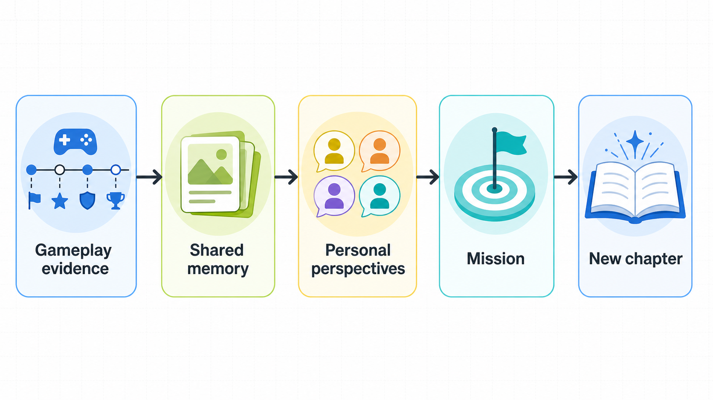

# Garena Next Chapter / MemoryOS

MemoryOS is the AI memory engine behind **Garena Next Chapter**. The current v1.1 compatibility
prototype turns synthetic historical Memory Packs into reviewable squad memories, distinct
teammate perspectives, and a grounded quest. The implemented v2 contract instead starts from raw
telemetry, constructs a consent-safe Story Brief with several feasible mission affordances, asks
AI to select one continuation and author its memory framing and short story bridge, then accepts it
only after privacy, evidence, and mission validation. The backend compiles the exact objective copy
from the selected deterministic capability.

The project answers two questions:

1. Which moments in a player's history are most likely to be worth remembering?
2. Can AI turn one eligible episode into a safe, evidence-backed next chapter without becoming the
   authority for telemetry, consent, or mission verification?

> [!IMPORTANT]
> This is a hackathon prototype built with synthetic fixtures. It does not connect to
> Free Fire production services, contain player data, or claim access to Garena's internal APIs.

## What the prototype demonstrates

- A server-owned synthetic squad history can become one evidence-backed shared memory.
- AI can choose among feasible episode-and-mission combinations and author the human-facing
  framing without controlling telemetry, consent, player identity, or verification rules.
- Invalid, unsafe, contradictory, or ungrounded AI output can be repaired once and is otherwise
  withheld; sparse context can produce an explicit abstention.
- A player can accept or decline a validated chapter, then enter a clearly labelled simulated squad
  continuation.

## Product flow



```text
synthetic gameplay evidence
    -> consent-safe episode and mission preparation
    -> AI memory, perspectives, and mission framing
    -> deterministic validation and objective compilation
    -> player decision
    -> labelled squad invitation and match simulation
    -> session-only history
```

## Architecture overview and responsibilities

The v2 path deliberately separates decisions that must be reliable from the creative proposal
that benefits from AI:

| Deterministic code owns | AI proposes |
|---|---|
| Raw-input normalization, source-quality gates, consent, and eligible event windows | Selection of one offered chronological event window |
| Allowed identities, facts, current-context signals, media mappings, and mission affordances | Ranking and selection of one offered affordance plus player-facing language |
| Selected match/event IDs, complete `GroundedClaim` records, perspective roster, media, mission family, assignments, exact objective descriptions, objective rules, and invitation eligibility | Title, summary, current relevance, perspectives, mission title, and a short story bridge within the supplied facts and capabilities |
| Proposal validation, correction eligibility, delivery status, suppression, and final decision state | No telemetry, consent, source-quality, or final-status authority |

Source quality is resolved upstream. The player decides whether a validated delivery is relevant;
**Details are wrong** creates an operations signal and never edits trusted telemetry in the client.

## AI-first v2 implementation

```text
raw telemetry
    -> deterministic normalization, consent filtering, and eligible windows
    -> typed Story Brief and feasible, verifiable mission affordances across six supported families
    -> AI comparison of episode x mission options and one compact typed draft, or a grounded abstention
    -> deterministic proposal/control enrichment and exact objective-copy compilation
    -> deterministic grounding, privacy, media, and mission validation
    -> delivery/trace construction, not-generated abstention, or a closed rejection
```

The compact draft is an internal provider contract, not a weaker public contract. AI chooses one
offered window and writes memory language, perspectives, a mission title, a short story bridge, and
small fact/capability references. The backend
resolves those references and derives the authoritative match and event IDs, complete grounded
claims, the ordered and validated perspective list, media mapping, and the selected affordance's
complete objective set, exact objective descriptions, and controls. The story bridge remains in the
public `next_chapter.mission` field, while the backend-compiled steps remain in
`next_chapter.objectives`. The backend does not create a missing perspective: the provider must return every eligible
player ID exactly once. After the full proposal validates, the pipeline creates the delivery record,
safe Studio trace, and public result. Unresolvable or unsupported references fail closed. The public
v2 response remains the
fully enriched `InterpretDeliveryResultV2`.

The provider receives the consent-safe `previous_session_at`, `days_since_full_squad`,
`recent_rematch_count`, active-player, available-mode, and reunion-eligibility signals. Secret-like
or instruction-unsafe social text is removed or rejected before provider use. Privacy-safe display
labels such as `Player 3` remain groundable identities even though the original identity is hidden.

Normalized event facts carry an explicit `event_scope`: `player` events retain actor/target roles,
`squad` events describe the squad collectively, and `match` events describe match-level facts.
Provider perspective permissions list each eligible player's direct-role events and only those
squad events whose allowlisted membership count proves that the full submitted roster participated.
Categorical telemetry details pass deterministic value allowlists. Categorical and ordinary numeric
detail claims require lexical detection of both the value and an associated field/action cue;
survival wording may instead use a positive squad-alive detail without restating its numeric count.
Literal player, action, location,
or match terms may add conservative candidate evidence from the selected episode; they do not create
a unique semantic proof and the complete tuple, prose, and claim validators still run. To keep the
claim set bounded, expansion retains lexically selected candidate events for a section, or at most
one cited fallback event when no event evidence is inferred.

Each mission affordance groups two to five ordered backend-owned objective capabilities and an `authoring_scope`
containing only its permitted intent, player IDs, and targets. At the provider boundary, neutral
windows, feasible affordances, and their nested typed objectives receive request-scoped `W#`, `A#`,
and `O#` references. The provider ranks the `A#` choices and writes the selected mission title and
short story bridge; each `A#` is an episode-and-mission pair, so the first ranked `A#` selects both the
continuation and its linked episode without a redundant selected-window output field. The backend
then resolves those short references to the authoritative window, family, recipe, assignments, source
evidence, exact objective descriptions, and verification rules. For every specialized family,
deterministic composition keeps its primary mechanic, adds only compatible capabilities from the
same neutral window, and never pads a chapter with fabricated actions. The player still receives
one clear Next Chapter rather than an internal candidate menu.
The ordered grammar is explicit: an invitation-safe prerequisite, zero to three compatible
mechanics, and match completion. Reunion has no primary mechanic; each specialized family has one
required primary plus up to two support or optional bonus mechanics. Bonus objectives are the only
optional steps and never decide whether the chapter completes. Current grounded bonus
capabilities include the first tactical signal and a full-squad vehicle escape within 60 seconds;
both require their exact source events in the selected window.
The model is instructed to choose the strongest direct evidence-linked continuation, not the first
serialized candidate. Role reversal can continue a rescue episode, redemption can continue a
repeated near miss, return to place can call back to a named rescue site, landing rendezvous can
continue a complete invited-squad drop, and duo assist can continue a proven assist-to-elimination
pair. Reunion remains the general fallback when no more coherent specific continuation is
supported. `A#` order and reference number, and the number of nested `O#`
objectives, are deliberately not preference signals. This is AI selection guidance rather than a
deterministic family ranking: final validation checks grounding, consent, feasibility, and rule
consistency without automatically preferring one mission family. The provider's story bridge does
not have to restate every backend-owned rule. The backend compiles each selected `O#` into its exact
public objective description instead.
Conservative lexical mission checks reject tested conflicting actions, operators,
metric-associated target counts, player names, and known unoffered gameplay conditions; unrelated
participant counts are not mistaken for the mission target. These bounded checks are not a universal
semantic proof for unrestricted prose.
The provider Story Brief also includes neutral evidence scopes that bind canonical event roles and
exact categorical terms to consent-safe evidence IDs. Typed mission capabilities explain only what
the game can verify; neither the scopes nor the capabilities pre-author a memory or its story. The
backend uses those capabilities to compile objective copy, and deterministic reference resolution
plus the existing claim, role, privacy, and mission validators remain authoritative.
When one bounded correction is allowed, the request reuses the unchanged provider-visible `W#`,
`A#`, and `O#` catalogue. Safe issue sections and request-scoped references never expose canonical
backend selection IDs. Rejected prose and free-form validator messages are still withheld.
Optional media remains backend-selected only when every event represented by that media reference
is inside the selected episode (`media.event_ids` is a subset of the selected event IDs). Media for
collective or match-scoped events requires media consent from the complete submitted roster because
actor/target fields cannot identify everyone potentially visible.

Validation checks the AI-authored story bridge for contradictory targets or operators, unoffered
mechanics, unsupported facts, privacy violations, and unsafe content; it no longer requires that
bridge to restate every backend-owned rule. The backend-compiled objective descriptions carry those
requirements exactly. Delivered memory categories are also checked against episode/history signals
(for example, `first` cannot be used when prior sessions exist). Secret-like, unsafe, or unsupported
observation language fails closed before delivery.

This smaller structured output is intended to reduce malformed or internally inconsistent model
responses without moving authority from deterministic code to AI. A historical telemetry-only
smoke run passed on 8 August 2026 with Groq `openai/gpt-oss-120b` and the former
`memory-interpreter-v2.4-grounded-controls` prompt. The current v2.1 mission-affordance contract uses
`memory-interpreter-v2.13-perspective-safe-variation` from `memory_interpreter_v2_13.txt`; the historical
result is not evidence for the newer prompt or for the default 20B model.

Two controlled historical live smokes on 9 August 2026 used Gemini `gemini-3.6-flash` and
`memory-interpreter-v2.10.1-category-safe-perspectives`. The synthetic rescue selected `role_reversal` and
completed in 4.74 seconds; repeated near misses selected `redemption` and completed in 4.81 seconds.
Both passed validation without correction. These are two successful paths, not a complete provider
reliability, reunion-counterfactual, or abstention matrix, and not evidence for the active V2.13
prompt.

The general v2 API boundary is `POST /v2/memories/interpret-delivery`. The player prototype uses
`POST /v2/memories/interpret-varied-delivery`, followed by
`POST /v2/deliveries/{delivery_id}/decision`. A live provider failure, refusal, malformed output,
or failed correction returns no player-facing proposal. A validated AI abstention instead returns
`not_generated` with no artifacts. Gemini `gemini-3.6-flash` is the preferred hosted prototype v2
provider. Groq GPT-OSS and OpenAI remain available as alternatives. Deterministic narrative
generation remains useful for tests, but the current Studio checkpoint produces no deterministic
narrative and is not a live-AI fallback.

The player route holds one coherent synthetic squad history on the server. For each new chapter it
generates a private nonce, removes the last two successfully delivered mission families when other
grounded choices exist, and gives Gemini at most three distinct specialized affordances to compare.
Gemini still selects the episode-and-mission pair and authors its narrative; deterministic
preparation, objective compilation, and validation remain authoritative. `reunion` is used only
when no specialized family is available. A rerun consumes provider quota and resets the prior
player-flow state before generation.

Developer Studio now compares five backend-owned, versioned scenarios: rescue to role reversal,
landing together to landing rendezvous, an assist-to-elimination pair to duo assist, repeated near
misses to redemption, and ordinary sparse telemetry to a possible abstention. It loads their safe
descriptors through `GET /v2/studio/scenarios`, inspects deterministic preparation
through `POST /v2/studio/scenarios/{scenario_id}/prepare`, and starts a live interpretation through
`POST /v2/studio/scenarios/{scenario_id}/interpret`. Preparation performs normalization, privacy
filtering, neutral-window construction, and affordance compilation with **zero provider calls**.
The expected status/family labels come from the offline evaluation manifest and never enter raw
telemetry, the Story Brief, or provider input.

Studio does not cache or deduplicate completed interpretations. Its browser lock prevents a second
concurrent click, but every new live-run click starts a fresh pipeline execution and may use two
provider calls when the one permitted correction is needed. A reviewed `saved_live_replay` may be
shown only in Studio when it matches the exact fixture version and carries internally consistent
recorded provider, model, prompt, result-schema, and capture-time provenance. The committed replay
registry is currently empty. There is no generic rescue or deterministic narrative fallback. The
player path accepts only `live_ai_validated` content.

The implemented v1.0/v1.1 endpoints remain available as compatibility surfaces alongside the
separate v2 raw-telemetry DTO, proposal validator, API routes, and frontend adapter. V2 does not
inherit the composed `MemoryPackV11` input contract.

## What the current v1.1 backend supports

- Strict, versioned Memory Pack and response contracts
- Historical discovery across up to 50 packs with an explainable deterministic top-three ranking
- Duplicate suppression and candidate diversity
- Separate source-verification and meaning-confirmation states
- Consent-aware evidence compilation and stable anonymization of opted-out players
- Bounded discovery, perspective, and quest generation stages
- Deterministic evidence-reference, assignment, lexical-claim, distinctness, and safe-abstention
  checks
- A credential-free deterministic provider plus Gemini, Groq GPT-OSS, and OpenAI live providers
- FastAPI, command-line, pytest, and generated OpenAPI entry points

## Prerequisites

- Python 3.11 or newer.
- Node.js 22.13 or newer and npm for the frontend.
- Git for cloning and handoff work.
- A Gemini, Groq, or OpenAI key only when running an explicitly selected live provider. All tests
  and deterministic preparation run without credentials.

## Backend setup

```powershell
cd MemoryOS
python -m venv .venv
.venv\Scripts\Activate.ps1
python -m pip install -e ".[dev]"
$env:MEMORYOS_PROVIDER = "deterministic"
pytest
```

Run the API in deterministic mode (the safe default, made explicit here so a local `.env` cannot
silently select an external provider):

```powershell
$env:MEMORYOS_PROVIDER = "deterministic"
uvicorn backend.main:app --reload
```

Open `http://127.0.0.1:8000/docs` for the live request and response schemas.

The original single-pack CLI remains useful for a credential-free golden-path check:

```powershell
python -m backend.run_memory backend/data/funny_memory.json --provider deterministic
```

The current v1.1 compatibility flow is:

```text
POST /v1/memories/discover-history
    -> player verifies and confirms one candidate
POST /v1/memories/generate
    -> validated memory + perspectives + quest
```

Each history request uses one target, squad, roster, and current consent snapshot. The base `score`
is the weighted component sum and controls the `0.45` eligibility gate; the separate
`ranking_score` may subtract the `0.08` repeated-type diversity penalty during top-candidate
selection. Clients consume both values from OpenAPI instead of recomputing them.

`POST /v1/memories/discover` remains available as the deprecated v1.0 single-pack compatibility
route. Unlike the new review-gated route, it preserves the legacy behavior in which an unconfirmed
pack can still produce reviewable draft artifacts. New clients must use `/generate` for the split
source/meaning gate.

The streaming route is an NDJSON snapshot view of the same completed generation call, not a second
AI implementation, token stream, or real-time per-stage trace.

Only the top-level `status: "ready"` marks artifacts as ready. The nested `validation.passed` field
can also be true for a safe abstention or a candidate waiting for human review, so clients must not
use it as a readiness shortcut.

## Run in VS Code

Open the repository folder and accept the recommended Python extension. The workspace selects
`.venv\Scripts\python.exe` and enables pytest discovery automatically. In **Run and Debug**:

- **MemoryOS: Run API** starts FastAPI in deterministic mode.
- **MemoryOS: Run API (Live Gemini 3.6 Flash)** selects the preferred hosted prototype provider and
  reads `GEMINI_API_KEY` from the local environment or `.env`.
- **MemoryOS: Run API (Live Groq GPT-OSS 20B)** selects the Groq alternative and reads
  `GROQ_API_KEY` from the local environment or `.env`.
- **MemoryOS: Run API (Live OpenAI)** explicitly selects the paid provider and reads the key from
  the local environment or `.env`.
- **MemoryOS: Run Golden Path** processes the original confirmed fixture in the terminal.

## Environment variables and live AI

Configuration is server-side. `.env` is Git-ignored and loaded by the application, and provider credentials must never use a
`NEXT_PUBLIC_` variable or enter browser code.

| Variable | Purpose | Default |
|---|---|---|
| `MEMORYOS_PROVIDER` | `deterministic`, `gemini`, `groq`, or `openai` | `deterministic` |
| `GEMINI_API_KEY` | Gemini credential for live generation | unset |
| `GEMINI_MODEL` | Gemini model identifier | `gemini-3.6-flash` |
| `GEMINI_V2_MAX_OUTPUT_TOKENS` | Bounded V2 response budget | `4000` |
| `GROQ_API_KEY`, `GROQ_MODEL` | Optional Groq provider configuration | key unset; GPT-OSS 20B |
| `OPENAI_API_KEY`, `OPENAI_MODEL` | Optional OpenAI provider configuration | key unset |
| `MEMORYOS_PROXY_TOKEN` | Optional shared secret between trusted frontend and backend servers | unset |
| `MEMORYOS_API_URL` | Frontend-server URL for the FastAPI backend | local backend URL |
| `MEMORYOS_CORS_ORIGINS` | Explicit browser origins accepted by FastAPI | documented local origins |

The current V2 contract recommends Gemini `gemini-3.6-flash`, loads
`memory-interpreter-v2.13-perspective-safe-variation` from
`backend/prompts/memory_interpreter_v2_13.txt`, emits result schema `2.1`, uses low reasoning, allows
one semantic repair, sets a 60-second provider timeout, and disables hidden SDK transport retries.

Deterministic mode is intentionally the default: it is repeatable, free, and cannot spend API
credits accidentally. To opt in to live generation:

```powershell
Copy-Item .env.example .env
```

Add the following server-side Gemini settings to `.env`:

```dotenv
MEMORYOS_PROVIDER=gemini
GEMINI_API_KEY=your_server_side_key
GEMINI_MODEL=gemini-3.6-flash
GEMINI_V2_MAX_OUTPUT_TOKENS=4000
```

Then launch the API:

```powershell
$env:MEMORYOS_PROVIDER = "gemini"
uvicorn backend.main:app --reload
```

Never commit `.env` or expose the key to browser code. The model receives a sanitized evidence
ledger plus the preceding typed stage output. It produces typed semantic outputs; deterministic
validation still decides whether the result may be returned as ready. Validation combines exact
schema/reference checks with conservative lexical heuristics, so human source and meaning review
remain essential. Gemini uses Google's official OpenAI-compatible endpoint, low reasoning, no
explicit temperature, a 60-second per-attempt timeout, no hidden SDK transport retries, and a strict
schema with provider-unsupported hints removed. MemoryOS may make one explicit semantic correction;
the same-origin proxy allows 130 seconds for that bounded path. Returned JSON still has to pass the
complete Pydantic and deterministic validators.
Use only synthetic, non-sensitive telemetry for free-tier prototype testing; this configuration is
not approval to process production player data. Groq remains available with
`MEMORYOS_PROVIDER=groq` and `GROQ_API_KEY`; OpenAI remains available with
`MEMORYOS_PROVIDER=openai` and `OPENAI_API_KEY`.

For a deployed server-side frontend proxy, `MEMORYOS_PROXY_TOKEN` can additionally protect
data-bearing routes, including Studio trace retrieval, through the `X-MemoryOS-Proxy-Token`
header. Leave it unset for local development, and never expose it in client-side JavaScript.

In the implemented v1.1 live mode, three bounded model stages write player-facing narrative onto
deterministic scaffolds. The v2 route replaces those stages with one compact typed draft followed by
deterministic enrichment, while deterministic code still owns eligibility, consent, evidence
constraints, match/event IDs, complete claims, media, roster, assignments, verification rules,
delivery/trace construction, and final status. A failed v2 live call will fail closed instead of
silently substituting deterministic narrative.

See [the API guide](docs/api.md) for configuration and request shapes.

## Frontend setup

The integrated `frontend/` contains the mobile-first player experience, AI Memory Inbox, reunion
simulation, read-only history, and Developer Studio. The canonical `/` route uses same-origin
proxies for v2 interpretation and decisions. `/history` is a read-only timeline and never prepares
a delivery or records a decision.

```powershell
cd frontend
npm ci
npm run dev
```

Run the backend from the repository root before opening the frontend. The player route requires a
configured live provider and fails closed when it is unavailable. A delivered player memory is
labelled **AI-prepared · evidence-checked** and is accepted only when its provenance is
`live_ai_validated`. Studio preparation remains available without a provider, while a compatible
saved live replay is Studio-only and cannot enter the player delivery route.

The hosted Vinext/Cloudflare site does not run the Python service. Live hosted AI therefore needs a
separately deployed HTTPS FastAPI backend. For the preferred prototype path, store `GEMINI_API_KEY`,
`GEMINI_MODEL=gemini-3.6-flash`, `GEMINI_V2_MAX_OUTPUT_TOKENS=4000`,
`MEMORYOS_PROVIDER=gemini`, and the optional `MEMORYOS_PROXY_TOKEN` on that backend; configure only
`MEMORYOS_API_URL` and the matching proxy token in the frontend server environment. Never place a
provider key in the browser bundle.

## Run both applications

Use two terminals after completing both setup sections:

```powershell
# Terminal 1, repository root
$env:MEMORYOS_PROVIDER = "deterministic"  # use gemini only for an explicit live run
uvicorn backend.main:app --reload

# Terminal 2
cd frontend
npm run dev
```

Open `http://localhost:3000`. The frontend server calls FastAPI at
`http://127.0.0.1:8000` unless `MEMORYOS_API_URL` is configured. Restart the backend after changing
provider settings or keys. Deterministic mode supports fixture preparation and offline evaluation;
the complete player or live Studio interpretation requires `gemini`, `groq`, or `openai` plus its
server-side credential.

## Main routes

| Route | Purpose |
|---|---|
| `/` | Generate and review one validated player memory from the unified synthetic squad history |
| `/mission` | Invitation, lobby, and explicitly simulated continuation |
| `/history` | Read-only, session-local chapter timeline |
| `/studio` | Scenario preparation, live interpretation, validation trace, and delivery inspection |
| `http://127.0.0.1:8000/docs` | Interactive FastAPI/OpenAPI reference |

## Main API endpoints

| Endpoint | Purpose |
|---|---|
| `GET /health` | Configuration and provider health without consuming model tokens |
| `POST /v2/memories/interpret-delivery` | Interpret supplied V2 telemetry through the validated pipeline |
| `POST /v2/memories/interpret-varied-delivery` | Player flow with bounded server-owned mission variety |
| `GET /v2/studio/scenarios` | Return safe versioned Studio descriptors |
| `POST /v2/studio/scenarios/{scenario_id}/prepare` | Deterministic preparation with zero provider calls |
| `POST /v2/studio/scenarios/{scenario_id}/interpret` | Fresh live interpretation for one registered fixture |
| `POST /v2/deliveries/{delivery_id}/decision` | Record accept or one controlled decline reason |
| `GET /v2/deliveries/{delivery_id}/trace` | Return the sanitized developer trace |

The `/v1/*` endpoints remain compatibility surfaces. New player and Studio work should use V2.

## Demo fixtures and walkthrough

Developer Studio owns five versioned scenarios:

| Scenario | Use in a demo |
|---|---|
| Rescue sequence | Hero path: rescue evidence to a role-reversal chapter |
| Landing rendezvous | Alternative path: a complete squad landing at one named location |
| Duo assist | Alternative path: a grounded assist-to-elimination pair |
| Repeated near miss | Alternative path: two placements supporting redemption |
| Ordinary sparse telemetry | Insufficient-context path: explicit abstention/no player delivery |

For the hero demo, start both applications, open `/studio`, select **Rescue sequence**, prepare the
scenario, and then run the live interpretation. Inspect the Mission tab and Stage 04 accepted-for-
inspection preview; this Studio convenience does not record a player decision. Use `/` for the actual
player decision and `/mission` for the labelled simulation.

For alternatives, repeat the Studio flow with Landing rendezvous, Duo assist, or Repeated near miss.
For insufficient context, select Ordinary sparse telemetry and confirm that no player delivery is
created. Run every committed label without credentials with:

```powershell
python -m backend.evaluate_v2 --provider deterministic
```

Live Studio interpretation consumes provider quota and may use one additional bounded repair call.
Deterministic preparation and deterministic evaluation consume none.

## Verify changes

After the backend virtual environment and frontend packages are installed, run the complete
credential-free handoff suite from the repository root:

```powershell
python scripts/verify.py
```

The script runs the backend formatter check, lint, tests, dependency check, both deterministic
evaluators, the production dependency audit, TypeScript check, frontend lint, build, and rendered
flow tests. The equivalent individual commands are:

```powershell
$env:MEMORYOS_PROVIDER = "deterministic"
ruff check .
ruff format --check .
pytest

cd frontend
npm ci
npm run audit:production
npm run typecheck
npm run lint
npm test
```

CI tests Python 3.11 and 3.13. The test suite includes the OpenAPI contract smoke test, ranking and
compatibility cases, privacy failures, provider failures, and the original Phase 1 golden paths.

Run the synthetic fixture-regression harness without credentials:

```powershell
python -m backend.evaluate
```

Live evaluation is deliberately opt-in and may incur API cost:

```powershell
python -m backend.evaluate --provider gemini
python -m backend.evaluate --provider groq
python -m backend.evaluate --provider openai

# Current v2.1 labelled manifest; explicitly permits hosted API use
python -m backend.evaluate_v2 --provider gemini --allow-live-api
```

## Repository map

```text
MemoryOS/
|-- backend/
|   |-- agents/          # Bounded semantic and validation stages
|   |-- data/            # Synthetic Memory Pack fixtures
|   |-- models/          # Pydantic API and pipeline contracts
|   |-- prompts/         # Version-controlled model behavior
|   |-- services/        # Evidence, ranking, and provider boundaries
|   |-- main.py          # FastAPI app and OpenAPI contract
|   |-- v2_pipeline.py   # Canonical V2 interpretation and delivery orchestration
|   `-- pipeline.py      # V1 compatibility orchestration
|-- docs/                # Product, architecture, API, decisions, and evaluation
|-- frontend/            # Integrated player, mission, history, Studio, and API proxy routes
|-- scripts/             # Cross-platform repository verification entry point
`-- tests/               # Contract, ranking, grounding, privacy, and pipeline tests
```

## Documentation

| Document | Purpose |
|---|---|
| [Product context](docs/product_context.md) | Product thesis, experience loop, and guardrails |
| [Architecture](docs/architecture.md) | Historical ranking, AI boundary, trust, and privacy |
| [V2.1 mission affordances](docs/mission-affordances-v2.1.md) | Dynamic mission selection and the scripted prototype-game boundary |
| [API reference](docs/api.md) | Endpoints, status flow, configuration, and handoff |
| [Decision log](docs/decisions.md) | Accepted architecture decisions |
| [Evaluation](docs/evaluation.md) | Quality metrics and regression workflow |
| [Roadmap](docs/roadmap.md) | Integration path and production questions |
| [Shank integration review](docs/shank-integration-review.md) | Merge choices, compatibility, and next work |
| [Phase 1 foundation](docs/phase-1-foundation.md) | Original single-memory vertical slice |

## Live, deterministic, saved, and simulated behavior

| Surface | What is real in this repository | What is not real |
|---|---|---|
| V2 live interpretation | A configured provider selects an offered episode/affordance and authors bounded prose; backend validation is real | It is not production telemetry ingestion or a guarantee of model quality |
| Deterministic preparation | Normalization, consent filtering, event windows, capabilities, objective rules, and validation | It does not author or select a live player narrative |
| Saved Studio replay | A reviewed historical live result with exact provenance, labelled `mode: saved_replay` | It makes no current provider call and cannot enter the player route |
| Player decision | Accept/decline is recorded in process-local prototype state | It is not authenticated or durable |
| Invitation and match continuation | UI transitions and family-specific completion presentation | Invites, joins, gameplay, and post-match verification are simulated |
| History | Read-only timeline for the current browser session | It is not a durable squad record |

## Data, privacy, and consent

All committed fixtures are synthetic. Current consent is evaluated before prompting or delivery;
opted-out identities are removed or anonymized, invitation eligibility remains backend-owned, and
rejected provider prose is withheld. Provider keys and the optional proxy token stay on servers.
The player projection excludes raw telemetry, canonical player IDs, evidence controls, verification
rules, validation issues, and Studio traces. This prototype is not approved for real player data,
and it has no production retention, deletion, authentication, or notification policy.

## Third-party software, services, and media

- FastAPI, Pydantic, Uvicorn, HTTPX, pytest, Ruff, and the OpenAI Python SDK support the backend.
- Gemini uses Google's OpenAI-compatible API; Groq and OpenAI are optional server-side providers.
- React, Vinext, Vite, TypeScript, ESLint, Tailwind tooling, and Cloudflare tooling support the
  frontend and its Sites-compatible worker build.
- OpenAPI TypeScript generation uses `openapi-typescript` and Redocly tooling.
- All gameplay records are project-authored synthetic fixtures. Committed UI art is static prototype
  media; the system performs no video understanding and sends no image frames to the model.

See `LICENSE` and the package manifests for exact software licensing and versions. Free Fire and
Garena product names are contextual references for the challenge prototype, not bundled datasets or
production integrations.

## Troubleshooting

- **The frontend cannot reach MemoryOS:** verify FastAPI is running on port 8000 or set the
  server-side `MEMORYOS_API_URL`.
- **A new key is ignored:** restart the backend; environment files are loaded when the pipeline is
  constructed.
- **Studio preparation works but live interpretation fails:** preparation is credential-free. Check
  `MEMORYOS_PROVIDER`, the matching server-side key, model access, quota, and `/health`.
- **PowerShell blocks `npm.ps1`:** use `npm.cmd` for the same npm command or adjust the local execution
  policy according to your organization policy.
- **The player receives no memory:** inspect Studio. Abstention, provider failure, malformed output,
  and failed validation intentionally produce no player delivery.
- **Generated API types appear stale:** activate the repository virtual environment, run
  `npm run generate:api-types` inside `frontend`, then rerun backend and frontend contract checks.

## Known limitations

- The AI-first v2 path is implemented with synthetic telemetry and prototype process-local state;
  it is not connected to Garena production telemetry, authentication, or notifications.
- Fixtures represent data Garena could plausibly assemble; they are not a published Garena schema.
- Delivery decisions are process-local, there is no player authentication or notification delivery,
  and observability is reported as completed stage snapshots rather than a live token trace.
- The invitation, lobby, game, and successful completion sequence is a labelled static simulation.
  Live post-match telemetry ingestion and objective verification are deferred. Its completion
  chapter title is selected deterministically from a family-specific title set, with a
  collision-safe alternative when it would repeat the accepted mission title.
- Developer Studio does not cache or deduplicate completed live interpretations. Every explicit
  live-run click may use an initial provider call plus one correction call. The UI only blocks
  duplicate concurrent clicks.
- The saved-replay mechanism is Studio-only, requires exact scenario and live-run provenance, and
  currently has no committed replay artifacts. It is not a generic rescue fallback.
- Deterministic ranking weights are prototype hypotheses and need calibration against player labels.
- The validator checks typed references and selected lexical patterns; it cannot prove that every
  possible natural-language implication is supported by telemetry.
- The evaluation report is a synthetic regression summary. Its distinctness and grounding metrics
  are exact-string/reference proxies, not human judgments of story quality.
- Stable anonymization protects generated content inside one request; production identity handling
  requires a broader privacy and retention design.
- Live Gemini, Groq, or OpenAI mode needs a valid server-side key and separate latency and
  output-quality testing. Gemini free-tier prototype runs must use synthetic, non-sensitive data.
- Disconnecting an NDJSON client does not reliably cancel its synchronous worker or an in-flight
  provider request; work may continue until completion or timeout.
- The legacy player adapter still carries hand-written v1.0 compatibility guards; the v1.1 API
  surface is generated from OpenAPI and checked for drift.
- The Vinext build tool currently resolves `image-size@2.0.2`, whose ICNS, JXL, and HEIF parsers
  have upstream denial-of-service advisories without a patched release. It is development/build
  tooling only; this repository processes committed static WebP assets and exposes no untrusted
  image-upload or metadata-inspection path. Production dependency auditing remains a CI gate, and
  the Vinext dependency should be upgraded when it adopts a patched parser.
- Media is limited to curated synthetic clips, thumbnails, or keyframes with deterministic event
  mappings. The prototype performs no automated video understanding.
- Authenticated durable delivery decisions, suppression, feedback, deletion, and retention remain
  deferred until consent, privacy, and operations policies are approved.

## License

MemoryOS is available under the [MIT License](LICENSE). Copyright (c) 2026 Ryan Neo Liang Zhi.
