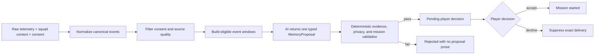

# MemoryOS architecture: AI-first v2 and v1.1 compatibility

## Objective

MemoryOS v2 is an AI-first interpretation pipeline. Its external input is raw, realistic synthetic
game telemetry plus limited squad context—not a pre-authored memory. Deterministic code establishes
the trusted evidence boundary, prepares eligible event windows, and validates the model's proposal
before anything reaches a player.

The correct product claim is:

> MemoryOS uses AI to turn trusted gameplay evidence into a grounded, personalized memory and
> reunion mission. Deterministic validation checks that the AI stayed within the supplied evidence.

AI is not the final authority on whether telemetry is authentic. That trust must come from an
authenticated telemetry adapter and source-quality controls. The player decides whether a validated
memory is relevant; the player is not asked to audit raw telemetry.

> **Implementation status:** the additive v2 contract, orchestration, validators, frontend adapter,
> and acceptance tests are implemented. Existing v1.0 and v1.1 routes remain runnable compatibility
> paths while production authentication, persistence, and telemetry integrations are deferred.



The engine is Python-first. FastAPI and its OpenAPI document remain the canonical backend/frontend
contract; a browser or Worker must not implement an independent normalization, scoring, consent, or
validation pipeline.

## V2 responsibility boundary

| Layer | Responsibility |
|---|---|
| Telemetry adapter | Map external game event names and shapes into a strict canonical vocabulary; reject unknown or unsafe data |
| Deterministic backend | Source trust, consent, filtering, deduplication, eligibility, event windows, mission controls, validation, and fail-closed delivery |
| AI Memory Interpreter | Select one offered connected episode and author one complete typed memory proposal |
| Player frontend | Render validated delivery content only and collect one accept/decline decision |
| Player | Judge relevance and choose whether to start the reunion mission |

The additive v2 raw contract contains match metadata, squad membership and current consent, canonical
telemetry events, structured current context, optional social signals, and optional media references.
It does not accept a title, memory type, summary, perspective, mission, selected evidence set, or
prewritten “why this surfaced” narrative. Optional captions and tags remain player-authored context,
not telemetry facts.

External event names and detail shapes must pass through a deterministic adapter before eligibility.
The adapter outputs a canonical event vocabulary with typed numeric details and rejects unknown or
unsafe fields. It is not a model stage. The legacy `MemoryPack` models remain unchanged for v1.0 and
v1.1 compatibility; v2 uses separate composed request models rather than inheriting their review and
scaffold semantics.

## V2 eligible windows and AI proposal

The deterministic backend builds bounded chronological windows from consent-safe canonical events.
Each offered window carries allowed event IDs, participant roles, locations, timestamps, numeric
facts, current-context signals, valid media mappings, and a deterministic mission-control bundle.
The AI may choose one offered window; it may not choose an arbitrary subset from the complete match.

One live provider call returns a typed `MemoryProposal` containing:

- selected event IDs, memory type, and narrative angle;
- title, notification teaser, summary, and why the memory matters now;
- exactly one evidence-linked perspective for each opted-in player;
- reunion mission title, recipe, mission text, and objective descriptions; and
- optional media selection only from the window's allowed mappings.

Evidence references accompany each factual clause or tightly constrained factual field. Player IDs,
event IDs, assignments, consent state, media mappings, and machine-verification rules remain
deterministic controls. A single bounded correction call may use validator issue codes; if the
corrected proposal still fails, v2 rejects it and exposes no generated prose.

## V1.1 compatibility: historical discovery

Historical discovery is deterministic. It is cheap enough to run across every submitted pack,
repeatable in tests, and explainable to a player reviewing a candidate. It does not call OpenAI.

Each eligible candidate receives four normalized score components:

| Component | Weight | What it measures |
|---|---:|---|
| Evidence strength | 35% | Specific events and connected gameplay patterns |
| Human signals | 30% | Captions, tags, saves, reactions, and review signals |
| Squad specificity | 20% | How strongly the episode depends on this squad and its roles |
| Reactivation relevance | 15% | Whether resurfacing the memory is timely in the current context |

The four stored components are already weighted. Their sum is both `score_breakdown.total` and
`score`, and the `0.45` eligibility threshold is applied to that unpenalized base score. Duplicate
match IDs then collapse to their strongest candidate. During iterative top-candidate selection, a
repeated memory type receives a `0.08` penalty, reported separately as `diversity_penalty`, and
`ranking_score` becomes `max(score - diversity_penalty, 0)`. Diversity can change selection order,
but cannot make a candidate eligible or ineligible. Remaining ties resolve by newest `played_at`,
then stable `pack_id` order. Offset-aware timestamps are preferred; a legacy timestamp without an
offset is interpreted as UTC so ordering does not depend on the backend host's timezone.

Hard filters run before ranking. A pack cannot surface when it has no grounded events, fewer than
two opted-in squad members, its target player opted out, its source is disputed, or its meaning was
dismissed. Requiring two consenting participants preserves the product's shared-memory premise and
prevents generation of a nominally social quest for one person.

A history request is one consent and identity boundary. Its 1-50 packs must share one squad ID,
target player, roster ID set, and current per-member consent snapshot, and every pack ID must be
unique. New endpoints require explicit consent even for a legacy v1.0 inner pack. This avoids
combining historical snapshots that disagree about who currently permits resurfacing.

## Evidence and privacy boundary

In v2, only a consent-safe ledger and eligible windows may reach the provider. When an event is
needed for factual continuity, an opted-out actor or target may remain only as a request-scoped
anonymous role; their raw ID and display name never cross the privacy boundary. Social content
authored by an opted-out player is excluded. Anonymous roles do not receive a perspective, media
identity, invitation, or mission assignment, and they do not count toward the minimum eligible
participants required for a shared memory.

The current v1.1 evidence compiler remains a compatibility boundary with its own stable aliasing
rules. V2 uses request-scoped aliases and recursively checks the complete outbound model payload
for private identity terms before interpretation.

Before a prompt is assembled:

- Opted-out identities become stable anonymous labels within the request.
- Opted-out players receive no perspective and cannot own a quest objective.
- An important shared event may remain only in anonymized form.
- Opaque pack, squad, match, and event IDs are rejected if they contain an opted-out identity.
- Unknown IDs in typed owners, assignees, and evidence references are rejected.

The validator checks generated facts against this ledger. A valid event ID alone is not enough: its
type, ownership, assignment, and quest verification shape must agree with the source event.
Conservative lexical rules also reject selected unsupported names, locations, numbers, actions,
relationships, emotions, and motives. These rules catch known failure patterns; they are not a
general proof that arbitrary natural language entails only ledger facts. Interpretive language
therefore remains reviewable and must not be presented as measured telemetry.

## V1.1 compatibility: split human trust

One confirmation flag cannot express two different questions. Schema v1.1 separates:

| State | Values | Question answered |
|---|---|---|
| `source_status` | `unreviewed`, `verified`, `disputed` | Did these events actually happen as described? |
| `meaning_status` | `unreviewed`, `confirmed`, `dismissed` | Does this moment matter to the player? |

On the new `/v1/memories/generate` route, AI generation starts only for `verified` + `confirmed`
inputs. Unreviewed candidates remain useful for discovery but cannot become re-engagement content.
Disputed or dismissed candidates are filtered. Legacy v1.0 `confirmed: true` maps to both positive
states; `false` maps to both unreviewed states, with the conversion recorded in response metadata.
The deprecated v1.0 `/discover` route intentionally preserves its older behavior and may create
reviewable drafts before confirmation; new clients must not use it as the Phase 2 trust boundary.

V2 removes the pre-generation player meaning gate. Authenticated ingestion and deterministic source
quality establish whether telemetry may be interpreted. The player then accepts or declines the
validated delivery. `not_relevant` is a relevance signal; `details_wrong` is a source-quality signal
for operations. Neither decision edits trusted telemetry or triggers automatic prompt changes.

## Stage ownership

| V2 stage | Model-capable? | Owned behavior |
|---|---:|---|
| Raw ingestion and normalization | No | Types, external-to-canonical mappings, provenance, and rejection |
| Consent and eligibility | No | Current consent, source quality, deduplication, and event-window construction |
| Memory proposal | Yes | Choose one offered window and author the complete player-facing interpretation |
| Proposal validation | No | Chronology, claim references, roles, privacy, context, media, and mission controls |
| Delivery and feedback | No | Final status, exact-delivery suppression, and structured decision semantics |

“Agent” means a bounded typed stage, not an autonomous multi-agent runtime. Stages have no authority
to bypass an earlier gate or weaken a later validation rule.

## V1.1 compatibility: narrative generation on deterministic scaffolds

Schema-constrained output is not, by itself, proof that free prose is grounded. MemoryOS therefore
separates player-facing language from factual and consent controls:

- The model authors the memory title, type, and summary, while the server fixes the evidence set,
  confidence, and confirmation state.
- The model authors one message per opted-in player, while the server fixes identity, ordering, and
  player-specific evidence references.
- The model authors quest title, mission, recipe, and objective descriptions, while the server fixes
  objective IDs, assignments, requirements, source events, and verification rules.

Live prompts receive control-only scaffolds. The pipeline copies model-authored narrative fields
onto the authoritative scaffold and ignores model attempts to change control fields. Narrative then
passes deterministic privacy, evidence, action, objective-alignment, and conservative lexical
checks before it can be returned. These checks deliberately fail closed but remain prototype
guardrails rather than a proof of every implication in natural language.

V2 replaces the three narrative scaffolds with one proposal schema plus structural controls. The
legacy scaffold path stays available for regression tests and explicitly labelled offline Studio
demonstrations, but it is not presented as a live v2 AI delivery.

## Provider boundary

The provider-neutral structured-generation interface remains reusable. The preferred v2 live
provider is the existing Groq GPT-OSS integration; the provider returns one `MemoryProposal` under a
strict schema. Provider refusal, timeout, malformed output, or failed deterministic validation fails
closed. V2 never substitutes deterministic narrative text into a response labelled as live AI.

Deterministic mode remains the credential-free regression baseline and may power explicitly labelled
offline Studio demonstrations. The current v1.1 compatibility path still uses three semantic stages
with the same sanitized ledger plus the previous typed output.

```text
sanitized evidence
    |-- deterministic stage implementation --|
    `-- structured live-provider stage call --|--> typed output --> deterministic validator
```

The OpenAI adapter uses the Responses API with Pydantic Structured Outputs and `store=False`. The
Groq adapter uses Chat Completions with an explicit strict JSON Schema and validates the returned
JSON through the same Pydantic response model. Both use low reasoning effort, a 30-second timeout,
at most two SDK transport retries, a 2,000-token legacy-stage ceiling, and a 4,000-token v2 proposal
ceiling. On a direct JSON route, a provider failure is reported as a structured HTTP `503`; the
service never silently changes a live request to deterministic prose. Once an NDJSON response has
begun, the equivalent failure is a typed `error` event under HTTP `200`.

## Status and failure behavior

`POST /v2/memories/interpret-delivery` returns either a fully validated
`pending_player_decision` delivery or a rejected/provider-error result with no generated artifacts.
Rejected proposal prose is never included in a player response or Developer Studio trace; Studio may
show stable issue codes and a structural, redacted validation trace only.

`POST /v2/deliveries/{delivery_id}/decision` records `accepted` or `declined`. A decline
requires exactly `not_relevant` or `details_wrong` and suppresses that exact process-local delivery.
Authentication, durable storage, retention, deletion, and operational review are deferred
until their consent and privacy policies are approved.

The following statuses describe the current v1.1 compatibility routes:

- Invalid schemas, mixed squads, and mixed target players fail with HTTP `422`.
- Ineligible, disputed, dismissed, or validation-failing packs return `rejected`.
- A strong unreviewed candidate returns `needs_source_verification`.
- A verified but unconfirmed candidate returns `needs_meaning_confirmation`.
- Only verified, confirmed, grounded output returns `ready`.
- On direct JSON routes, provider timeouts, refusals, quota failures, and malformed structured
  output return a retryability-aware HTTP `503` response. The NDJSON adapter reports the same fields
  in an HTTP `200` error event because its headers have already been sent.

Response bodies omit `memory` and `next_chapter` when their value is `null`; an empty perspectives
list remains present. A validation failure fails closed by withholding all generated artifacts.
The NDJSON route is a snapshot adapter: after an initial event it runs the same canonical call, then
emits completed previews. It is not token streaming or a live per-stage execution trace. Its
OpenAPI response describes the discriminated schema for one NDJSON line. Client disconnects do not
reliably cancel the synchronous worker thread or an in-flight provider call, so the prototype may
continue work until completion or timeout after its response consumer has gone away.

The top-level result `status` is authoritative for readiness. `validation.passed` can also be true
when deterministic abstention succeeded or when no validation error precedes a human-review gate;
only `status == "ready"` authorizes presentation of generated artifacts as ready.

## Frontend handoff: v1.1 compatibility and canonical v2

Legacy v1.1 review tools should use `/openapi.json` or `/docs`, derive client types from that
contract, display backend scores and reasons, preserve the selected compatibility pack, apply the
review decision, and resubmit that pack for generation. They must not recompute status, consent,
ranking, or validation, and a candidate rank or ID is not a generation token. Any prototype review
persistence must use the v1.1 state semantics above. This pack-resubmission workflow is retained for
compatibility only; it is not the canonical player delivery path.

The player frontend now has one canonical consumer flow split by responsibility:

- `/` prepares and reveals the current source-verified memory, its grounded explanation, the
  current player's perspective, and one reunion proposal. It alone owns **Accept mission** and the
  two structured decline reasons.
- `/mission` receives an accepted delivery through session-only React state and owns invitation,
  synthetic rematch, deterministic mission verification, and the resulting continuation chapter.
- `/history` is a compact, read-only timeline. It shows the current session milestones plus only
  sanitized metadata from eligible past packs; it does not prepare deliveries or record decisions.

The current-memory route uses the v2 interpretation contract through same-origin server proxies.
The server normalizes synthetic raw telemetry, asks one live model for a complete proposal, validates
its claims and mission controls, and returns `pending_player_decision`. A player can accept or decline;
`details_wrong` is a data-quality signal and `not_relevant` is a relevance signal. Neither lets the
browser rewrite telemetry. Generated types, runtime guards, and a backend snapshot test keep
FastAPI as the contract source of truth. The older discovery and split-review contracts remain only
for internal compatibility and quality workflows, not as a second player interface.

`/` proxies `/v2/memories/interpret-delivery` and
`/v2/deliveries/{delivery_id}/decision` without exposing backend credentials. `/history` remains
read-only and does not prepare a delivery or record a decision.

Developer Studio may display raw **synthetic** telemetry, deterministic normalization and window
metadata, provider/model/prompt version, evidence links from a validated proposal, validator issue
codes, final delivery status, and recorded prototype feedback. It must never display raw prompts,
chain-of-thought, credentials, opted-out identities, or rejected/unvalidated proposal prose.

## Phase 3 reunion prototype

The consumer continuation lives at `/mission`. A shared client provider carries the accepted
delivery between player routes for the current browser session, so the delivery is not placed in a
URL, browser storage, or treated as durable authorization. Refreshing or directly opening the route
therefore shows an honest no-active-mission state. An accepted decision unlocks a squad invitation
simulation built only from the delivery's privacy-filtered player perspectives. Opted-out roster
members never enter the invitation model.

The prototype then evaluates a labelled synthetic rematch against the quest's existing
machine-readable `equals`, `at_least`, and `contains_all` rules. Every required objective must pass
before the UI can construct the deterministic “Story Continues” chapter. `/history` then reflects
that milestone in its session timeline. This proves the continuation state machine and verification
semantics without claiming access to live Garena telemetry. Optional post-chapter relevance
feedback is session-only and deliberately excludes the `details_wrong` source-quality reason used
during the original delivery decision.

## Deferred production boundaries

This phase does not add authentication, durable backend storage, queues, notifications, production
telemetry, regional retention enforcement, cross-request pseudonym management, or real match-result
verification. Optional v2 media references are limited to curated synthetic clip, thumbnail, or
keyframe IDs mapped deterministically to allowed event IDs. The prototype makes no automated video
understanding claim. Unknown or mismatched media mappings fail closed. Production media access,
storage, deletion, and retention require Garena data contracts and privacy review.
