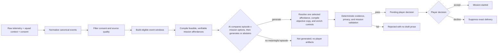

# MemoryOS architecture: AI-first v2 and v1.1 compatibility

## Objective

MemoryOS v2 is an AI-first interpretation pipeline. Its external input is raw, realistic synthetic
game telemetry plus limited squad context—not a pre-authored memory. Deterministic code establishes
the trusted evidence boundary, prepares eligible event windows, and validates the model's proposal
before anything reaches a player.

The correct product claim is:

> MemoryOS uses AI to turn trusted gameplay evidence into a grounded, personalized memory and
> one feasible **Next Chapter**. Deterministic validation checks that the AI stayed within the
> supplied evidence.

AI is not the final authority on whether telemetry is authentic. That trust must come from an
authenticated telemetry adapter and source-quality controls. The player decides whether a validated
memory is relevant; the player is not asked to audit raw telemetry.

> **Implementation status:** the additive V2.1 contract, orchestration, validators, player
> projection, five-scenario Studio registry, Studio trace, and acceptance tests exist.
> `RawTelemetryBatchV2` accepts both `2.0`
> and `2.1` input, while every `InterpretDeliveryResultV2` is `2.1`. The active prompt contract is
> `memory-interpreter-v2.12-richer-missions`, loaded from `memory_interpreter_v2_12.txt`. A
> historical 8 August 2026 Groq 120B smoke used the older V2.4 prompt; it is not evidence for the
> current V2.12 prompt and must be rerun before
> making current live-quality claims. Existing V1.0 and V1.1 routes remain runnable compatibility
> paths while production authentication, persistence, notifications, telemetry integration, and
> post-match verification are deferred.



The engine is Python-first. FastAPI and its OpenAPI document remain the canonical backend/frontend
contract; a browser or Worker must not implement an independent normalization, scoring, consent, or
validation pipeline.

## V2 responsibility boundary

| Layer | Responsibility |
|---|---|
| Telemetry adapter | Map external game event names and shapes into a strict canonical vocabulary; reject unknown or unsafe data |
| Deterministic backend | Source-quality boundary, consent, filtering, deduplication, neutral event windows, dynamic mission affordances, assignments, exact objective descriptions, metrics, operators, targets, source references, authoritative enrichment, validation, trace construction, and fail-closed delivery |
| AI Memory Interpreter | Return one provider-only typed decision: either `generate` with a complete ranking of request-scoped affordance references, memory language, perspectives, mission title, and a short story bridge, or `abstain` with `no_meaningful_episode`; the first ranked affordance determines its linked episode |
| Player frontend | Render one minimal validated memory projection and one player-facing **Next Chapter**, then collect one accept/decline decision |
| Developer Studio | Select one backend-owned versioned fixture, inspect zero-provider preparation, run the exact fixture through live interpretation, and render sanitized affordances, selection/reason codes, validation, abstention, or an exact-provenance saved live replay without exposing rejected prose or player-private controls |
| Player | Judge relevance and choose whether to start the selected **Next Chapter** |

The additive v2 raw contract accepts `schema_version` `2.0` or `2.1` and contains match metadata,
squad membership and current consent, provider telemetry events, structured current context,
optional social signals, and optional media references.
It does not accept a title, memory type, summary, perspective, mission, selected evidence set, or
prewritten “why this surfaced” narrative. Optional captions and tags remain player-authored context,
not telemetry facts.

External event names and detail shapes must pass through a deterministic adapter before eligibility.
The adapter outputs a canonical event vocabulary with typed numeric details and rejects unknown or
unsafe fields. Categorical detail keys and values are accepted only from deterministic allowlists.
Each normalized event explicitly carries `event_scope`: `player` preserves actor/target roles,
`squad` represents a collective squad action, and `match` represents a match-level fact. It is not a
model stage. The legacy `MemoryPack` models remain unchanged for v1.0 and v1.1 compatibility; v2 uses
separate composed request models rather than inheriting their review and scaffold semantics.

## Developer Studio scenario checkpoint and provenance

Developer Studio does not accept arbitrary raw telemetry under a named demo. A backend registry
owns exactly five committed scenarios and their fixture versions:

| Scenario | Offline expected behavior | Deterministic affordance space |
|---|---|---|
| `rescue-role-reversal` | `pending_player_decision` / `role_reversal` | Reunion, role reversal, and return to place |
| `landing-rendezvous` | `pending_player_decision` / `landing_rendezvous` | Reunion and landing rendezvous |
| `duo-assist` | `pending_player_decision` / `duo_assist` | Reunion and duo assist |
| `repeated-near-miss` | `pending_player_decision` / `redemption` | Reunion and redemption |
| `ordinary-sparse-telemetry` | `not_generated` | Feasible reunion, while AI decides whether the episode merits a memory |

`GET /v2/studio/scenarios` exposes safe descriptors with fixture SHA-256/revision and labels loaded
from the offline evaluation manifest. `POST /v2/studio/scenarios/{scenario_id}/prepare` performs
normalization, privacy filtering, neutral-window formation, and affordance compilation with zero
provider calls. `POST /v2/studio/scenarios/{scenario_id}/interpret` accepts no body and passes only
the exact registered `RawTelemetryBatchV2` into the existing live pipeline. Expected status/family,
scenario purpose, and fixture provenance remain outside `RawTelemetryBatchV2`, `StoryBriefV2`, and
the provider payload, so the labels measure behavior rather than steering it.

The Studio browser verifies the descriptor version at catalog, preparation, and interpretation
boundaries. It locks scenario switching and duplicate clicks while a request is active, but neither
the backend nor frontend caches or deduplicates completed live interpretations. Every later live
click is a new pipeline execution and may use two provider calls when the one permitted correction
is attempted.

The same-origin Studio layer may replay a reviewed live result only under the top-level
`saved_live_replay` origin and only when scenario ID, fixture hash/revision, provider, model, prompt,
result schema, and capture timestamp match exactly. The committed registry currently contains no
saved artifacts. This replay path is Studio-only and is not a result cache, player authorization,
generic rescue fallback, or deterministic narrative fallback. The player projection accepts only
`live_ai_validated` and displays **AI-prepared · evidence-checked**.

## V2 eligible windows, compact AI decision, and deterministic enrichment

The deterministic backend builds at most four bounded, chronological, narratively neutral windows
from consent-safe canonical events. Each offered window carries consent-safe roles, facts, context,
media capabilities, and dynamically compiled mission affordances behind bounded references. The
provider sees request-scoped `W#` window references, `A#` affordance references, and nested `O#`
objective references rather than canonical selection IDs. Each `A#` represents one feasible
episode-and-compound-mission pair with two to five ordered objectives, so the first ranked `A#`
chooses the linked episode and continuation
without a redundant selected-window output field. It may not choose an arbitrary event subset from
the complete match or author authoritative control values. Deterministic resolution restores
canonical IDs before the existing expander and validator run.

The Story Brief also carries compact deterministic `authoring_constraints` derived only from that
projected evidence. The ledger remains the event-role authority; per-player maps distinguish active,
passive, and full-squad evidence, while evidence-bound maps pair exact category/zone values with the
IDs that support them. Neutral typed objective capabilities state only the feasible assignment,
event/count, roster, or placement boundary for each `O#`. Together these maps make the safe writing
boundary explicit for the provider; they do not add narrative meaning and never replace the evidence
ledger or final validator. The provider uses the nested capabilities to compare supported
continuations; after selection, the backend compiles each chosen `O#` into an exact player-facing
objective description. The model still chooses the mission title, narrative connection, and
surrounding story language. Missing category entries prohibit the term, and a numeric zone phase does
not imply a qualitative zone state.

One live provider call returns `ProviderInterpretationDecisionV2`. It is exactly one of:

- `decision: "abstain"`, `abstention_reason_code: "no_meaningful_episode"`, and no proposal; or
- `decision: "generate"`, no abstention reason, and one `ProviderMemoryProposalV2`.

The generated proposal contains:

- a supported narrative framing for the episode linked by the first ranked `A#`;
- title, notification teaser, summary, and why the memory matters now;
- one distinct perspective, including the supplied player ID, for every eligible player role;
- a ranking containing each offered `A#` once, allowlisted selection reason codes, mission
  title and a short story bridge for the first `A#`; and
- compact references identifying which supplied facts and mission capabilities support each
  authored section.

The generated compact proposal intentionally omits authoritative match/event ID lists, complete
`GroundedClaim` objects, media objects, mission recipe, objective IDs, assignments, required flags,
exact objective descriptions, verification metrics, operators, targets, authoritative objective source references, roster records,
delivery state, and Studio trace. The
deterministic backend resolves each request-scoped reference to its canonical window, affordance,
and objective IDs, supplements only literal
player/action/location/match-value terms with conservative candidate evidence from the selected
window, then derives those fields from normalized telemetry, consent state, media mappings, and the
mission capability catalogue. This lexical enrichment is not a unique semantic mapping: expanded
claims and prose still pass the complete deterministic validators. Categorical and ordinary numeric
detail claims require lexical detection of the typed value plus an associated field/action cue;
survival wording may use positive squad-alive telemetry without restating its numeric count.
Expansion keeps lexically selected candidate event evidence for each section, or at most one
explicitly cited default event when no event evidence is inferred, so a model cannot inflate the
final claim set by citing every event. The backend orders the
provider-independent objective candidates into exact public objective descriptions. It also orders the
provider-supplied perspectives by the trusted roster and validates that their IDs equal the exact
eligible set; it does not restore or synthesize missing perspectives. The full proposal is validated
before the backend creates a delivery record, safe trace, and unchanged public
`InterpretDeliveryResultV2`.

The provider payload makes perspective permissions explicit. Each eligible player receives their
direct actor/target event IDs. A collective event is also offered for that perspective only when its
`event_scope` is `squad` and an allowlisted membership count proves that the entire submitted roster
participated. The model may describe such an event as "we" or "the squad", never as the narrator's
personal action. Match-scoped facts support match language, not individual action claims.
Privacy-safe aliases remain first-class grounding labels; hiding an original identity does not let
the model attach unsupported actions or observations to its replacement label.

The backend currently compiles exactly six affordance families, only when their evidence and
feasibility conditions hold. These are authoritative capability boundaries: the model can choose
and narrate one offered transformation but cannot invent a mechanic or verification rule. The
backend composes squad entry, one to three compatible same-window mechanics, and match completion
into a two-to-five-step chapter, then compiles every selected capability into exact objective copy.

| Family | Availability | Backend-owned continuation |
|---|---|---|
| `reunion` | Reunion is allowed, the mode is available, and at least two memory- and invitation-consented players include the target | Reassemble the invitation-ready roster and complete one match |
| `role_reversal` | The selected window contains a consent-safe revive between invitation-ready players | Add a first-future-revive assignment to the previously saved player |
| `redemption` | At least two supplied matches are near misses in places four through six | Add a top-three target |
| `return_to_place` | The selected window contains a consent-safe revive at a named location | Return to that rescue location with the invited squad |
| `landing_rendezvous` | The selected neutral window contains the first landing event for every invitation-ready player at one named location, spanning at most 30 seconds | Land at that location with the invited squad |
| `duo_assist` | An invitation-ready assist actor names a distinct invitation-ready teammate who performs an elimination at the same location zero to 30 seconds later | Assign the assister to help that teammate secure an elimination |

The provider compares the offered `episode × mission affordance` options and should normally rank
the strongest direct evidence-linked continuation first. A rescue can support `role_reversal`; a
named rescue site can support `return_to_place`; a complete shared drop can support
`landing_rendezvous`; a proven assist-to-elimination pair can support `duo_assist`; a repeated near
miss can support `redemption`; and `reunion` is the general fallback when no more coherent specific
continuation is supported. The backend does not hard-code this narrative choice.

Landing rendezvous is roster-complete by construction. For each named landing location in a neutral
window, deterministic preparation keeps the first landing event per invitation-ready player and
requires the resulting player set to equal the invitation roster with no more than 30 seconds
between the earliest and latest event. Duo assist likewise requires an explicit ordered source pair:
the assist target must perform the same-location elimination within 30 seconds. Nearby counts,
unattributed combat, and prose are not substitutes for either grounding rule.

The serialized order of affordances, request-scoped `A#` numbers, and nested `O#` count carry no
preference signal. They exist only for bounded reference resolution. The guidance to prefer a
coherent story continuation is part of the AI selection contract, not a deterministic family
priority: validation does not reject or prefer a family by label. It verifies that the chosen option
was offered and that its evidence, consent, assignments, mechanics, and authored story bridge are
valid.

The provider ranks only the affordances offered at runtime; the first `A#` is the selection and
determines its linked `W#`, so no duplicate selected-window field is model-authored. The backend
owns each selected affordance's objective set, recipe, assignments, metrics, operators, targets,
and source event/match/context references. The provider authors the mission title and short story
bridge, while the backend compiles exact objective descriptions from the selected capabilities.
Conservative validation does not require the story bridge to restate every rule; it rejects
contradictory targets or operators, unoffered mechanics, unsupported facts, privacy violations, and
unsafe content. It is a bounded guardrail rather than a universal semantic proof for unrestricted
prose. The complete deterministic factual, consent, privacy, assignment, metric, operator, and target
checks still run. The delivered memory
type is also checked against the selected episode and squad history, including the rule that a
`first` memory cannot coexist with prior session history.
Numbers attached to other nouns, such as a squadmate count, are not treated as the mission metric's
target. Optional media is selected only when `media.event_ids` is a subset of the chosen
episode's event IDs; a media reference need not cover the whole episode. Collective- or
match-scoped media requires media consent from the full submitted roster because its actor/target
fields do not enumerate everyone potentially visible.

The consent-safe provider context includes previous session timestamps, days since the full squad,
recent rematch count, active players, available modes, and reunion eligibility. Secret-like input is
rejected and unsafe/instruction-like social context is filtered before the provider boundary.
`active_player_ids` is context, not invitation authority. A memory- and invitation-consented player
remains invitation-ready when inactive; the browser may present that state as `away`, just as an
active player may be presented as `online`. Neither label changes backend eligibility.

Compact references are not a shortcut around grounding. A reference that is unknown, incompatible
with the selected window, attached to the wrong section or player, or insufficient for an authored
fact fails enrichment or validation. Full claims and all player-facing prose still pass the same
role, chronology, value, context, privacy, media, and mission checks. Validation also checks direct
player-action-target wording against one supported telemetry tuple, preventing literal enrichment or
separate cited events from being used to recombine a false role assignment. A single bounded
correction call uses stable issue codes and provider-visible section references. Correction feedback
keeps canonical backend candidate IDs hidden behind request-local `O#` references. The unchanged
`W#`/`A#`/`O#` catalogue prevents a corrected selection or story bridge from escaping the original
capability boundary.
Rejected generated prose and validator messages are never returned to the model. If correction
still fails, v2 fails closed and exposes no generated prose.

Reducing duplicated IDs and backend-owned controls in the provider schema should make structured
output easier for a live model to produce consistently. It does not weaken validation because the
removed fields are derived from deterministic sources rather than trusted from the model. Automated
compact-decision, abstention, affordance, enrichment, and projection checks pass. The historical
120B/V2.4 and Gemini/V2.10 smokes predate the current V2.12 prompt and therefore cannot establish
current prompt reliability; the expected improvement still requires a controlled V2.12 sample.

## V1.1 compatibility: historical discovery

Historical discovery is deterministic. It is cheap enough to run across every submitted pack,
repeatable in tests, and explainable to a player reviewing a candidate. It does not call OpenAI.

Each eligible candidate receives four normalized score components:

| Component | Weight | What it measures |
|---|---:|---|
| Evidence strength | 35% | Specific events and connected gameplay patterns |
| Human signals | 30% | Captions, tags, saves, reactions, and review signals |
| Squad specificity | 20% | How strongly the episode depends on this squad and its roles |
| Reactivation relevance | 15% | Whether resurfacing the memory is timely in the current context |

The four stored components are already weighted. Their sum is both `score_breakdown.total` and
`score`, and the `0.45` eligibility threshold is applied to that unpenalized base score. Duplicate
match IDs then collapse to their strongest candidate. During iterative top-candidate selection, a
repeated memory type receives a `0.08` penalty, reported separately as `diversity_penalty`, and
`ranking_score` becomes `max(score - diversity_penalty, 0)`. Diversity can change selection order,
but cannot make a candidate eligible or ineligible. Remaining ties resolve by newest `played_at`,
then stable `pack_id` order. Offset-aware timestamps are preferred; a legacy timestamp without an
offset is interpreted as UTC so ordering does not depend on the backend host's timezone.

Hard filters run before ranking. A pack cannot surface when it has no grounded events, fewer than
two opted-in squad members, its target player opted out, its source is disputed, or its meaning was
dismissed. Requiring two consenting participants preserves the product's shared-memory premise and
prevents generation of a nominally social quest for one person.

A history request is one consent and identity boundary. Its 1-50 packs must share one squad ID,
target player, roster ID set, and current per-member consent snapshot, and every pack ID must be
unique. New endpoints require explicit consent even for a legacy v1.0 inner pack. This avoids
combining historical snapshots that disagree about who currently permits resurfacing.

## Evidence and privacy boundary

In v2, only a consent-safe ledger and eligible windows may reach the provider. When an event is
needed for factual continuity, an opted-out actor or target may remain only as a request-scoped
anonymous role; their raw ID and display name never cross the privacy boundary. Social content
authored by an opted-out player is excluded. Anonymous roles do not receive a perspective, media
identity, invitation, or mission assignment, and they do not count toward the minimum eligible
participants required for a shared memory.

The current v1.1 evidence compiler remains a compatibility boundary with its own stable aliasing
rules. V2 uses request-scoped aliases and recursively checks the complete outbound model payload
for private identity terms before interpretation.

Before a prompt is assembled:

- Opted-out identities become stable anonymous labels within the request.
- Opted-out players receive no perspective and cannot own a quest objective.
- An important shared event may remain only in anonymized form.
- Opaque pack, squad, match, and event IDs are rejected if they contain an opted-out identity.
- Unknown IDs in typed owners, assignees, and evidence references are rejected.

The validator checks generated facts against this ledger. A valid event ID alone is not enough: its
type, ownership, assignment, and quest verification shape must agree with the source event.
Conservative lexical rules also reject selected unsupported names, locations, numbers, actions,
relationships, emotions, and motives. These rules catch known failure patterns; they are not a
general proof that arbitrary natural language entails only ledger facts. Interpretive language
therefore remains reviewable and must not be presented as measured telemetry.

## V1.1 compatibility: split human trust

One confirmation flag cannot express two different questions. Schema v1.1 separates:

| State | Values | Question answered |
|---|---|---|
| `source_status` | `unreviewed`, `verified`, `disputed` | Did these events actually happen as described? |
| `meaning_status` | `unreviewed`, `confirmed`, `dismissed` | Does this moment matter to the player? |

On the new `/v1/memories/generate` route, AI generation starts only for `verified` + `confirmed`
inputs. Unreviewed candidates remain useful for discovery but cannot become re-engagement content.
Disputed or dismissed candidates are filtered. Legacy v1.0 `confirmed: true` maps to both positive
states; `false` maps to both unreviewed states, with the conversion recorded in response metadata.
The deprecated v1.0 `/discover` route intentionally preserves its older behavior and may create
reviewable drafts before confirmation; new clients must not use it as the Phase 2 trust boundary.

V2 removes the pre-generation player meaning gate. Authenticated ingestion and deterministic source
quality establish whether telemetry may be interpreted. The player then accepts or declines the
validated delivery. `not_relevant` is a relevance signal; `details_wrong` is a source-quality signal
for operations. Neither decision edits trusted telemetry or triggers automatic prompt changes.

## Stage ownership

| V2 stage | Model-capable? | Owned behavior |
|---|---:|---|
| Raw ingestion and normalization | No | Types, external-to-canonical mappings, provenance, and rejection |
| Consent, windows, and affordances | No | Current consent, source quality, deduplication, no more than four neutral windows, and feasible/verifiable `reunion`, `role_reversal`, `redemption`, `return_to_place`, `landing_rendezvous`, and `duo_assist` affordances |
| Compact interpretation decision | Yes | Compare the offered episode-and-mission options, normally select the strongest direct evidence-linked continuation, author bounded player-facing text, or abstain with `no_meaningful_episode` |
| Authoritative enrichment | No | Resolve the window and selected affordance; derive proposal match/event IDs, full claims, media, roster, recipe, objectives, assignments, metrics, operators, targets, and source references |
| Proposal validation | No | Chronology, derived claim references, roles, privacy, context, media, prose support, and mission controls |
| Delivery construction | No | After validation, create the delivery record, safe Studio trace, and public result |
| Delivery and feedback | No | Final status, exact-delivery suppression, and structured decision semantics |

“Agent” means a bounded typed stage, not an autonomous multi-agent runtime. Stages have no authority
to bypass an earlier gate or weaken a later validation rule.

## V1.1 compatibility: narrative generation on deterministic scaffolds

Schema-constrained output is not, by itself, proof that free prose is grounded. MemoryOS therefore
separates player-facing language from factual and consent controls:

- The model authors the memory title, type, and summary, while the server fixes the evidence set,
  confidence, and confirmation state.
- The model authors one message per opted-in player, while the server fixes identity, ordering, and
  player-specific evidence references.
- The model authors quest title, mission, recipe, and objective descriptions, while the server fixes
  objective IDs, assignments, requirements, source events, and verification rules.

Live prompts receive control-only scaffolds. The pipeline copies model-authored narrative fields
onto the authoritative scaffold and ignores model attempts to change control fields. Narrative then
passes deterministic privacy, evidence, action, objective-alignment, and conservative lexical
checks before it can be returned. These checks deliberately fail closed but remain prototype
guardrails rather than a proof of every implication in natural language.

V2 replaces the three narrative scaffolds with one compact decision schema, deterministic
enrichment, and structural controls. The
legacy scaffold path stays available for regression tests and explicitly labelled offline Studio
demonstrations, but it is not presented as a live v2 AI delivery.

## Provider boundary

The provider-neutral structured-generation interface remains reusable. Gemini
`gemini-3.6-flash` is the preferred hosted prototype provider, with Groq GPT-OSS and OpenAI retained
as alternatives. The provider returns one strict `ProviderInterpretationDecisionV2`. A typed
abstention becomes `not_generated` without player artifacts. For `generate`, the backend, not the
provider, expands the compact proposal into an authoritative proposal; only a proposal that passes
deterministic validation becomes a public delivery and safe trace.
Provider refusal, timeout, malformed output, unresolved compact references, failed enrichment, or
failed deterministic validation fails closed. V2 never substitutes deterministic narrative text
into a response labelled as live AI.

Deterministic mode remains the credential-free regression baseline. It can serve the registered
Studio preparation checkpoint because that checkpoint generates no prose; a fresh Studio
interpretation still requires live AI. The current v1.1 compatibility path uses three semantic
stages with the same sanitized ledger plus the previous typed output.

```text
sanitized evidence
    |-- deterministic stage implementation --|
    `-- structured live-provider stage call --|--> compact typed decision
                                                --> deterministic proposal expansion
                                                --> deterministic validator
                                                --> public delivery + safe trace
```

The Gemini adapter uses Google's official OpenAI-compatible endpoint at
`https://generativelanguage.googleapis.com/v1beta/openai/`. It sends Chat Completions with low
reasoning, no explicit temperature, a 60-second per-attempt timeout, no hidden SDK transport
retries, a 2,000-token v1.1 ceiling, and a configurable 4,000-token compact-v2 default. MemoryOS
owns one explicit semantic correction and the same-origin proxy allows 130 seconds for that bounded
two-attempt path. It removes only
provider-unsupported JSON Schema hints from the strict wire schema; the returned JSON still must
pass the original Pydantic model and the complete deterministic validator. Free-tier prototype runs
are restricted to synthetic, non-sensitive telemetry and do not establish approval for production
player data.

The OpenAI adapter uses the Responses API with Pydantic Structured Outputs and `store=False`. The
Groq adapter uses Chat Completions with an explicit strict JSON Schema and validates the returned
JSON through the same Pydantic response model. Those adapters use low reasoning effort, a 30-second
timeout, at most two SDK transport retries, and explicit output ceilings. Compact v2 interpretation
uses a configurable 2,500-token Groq default for the prototype's 8K envelope; OpenAI retains a
4,000-token default. The provider projection omits only null placeholders and retains every concrete
evidence, consent, context, and mission value. On a
direct JSON route, a provider failure is reported as a structured HTTP `503`; the
service never silently changes a live request to deterministic prose. Once an NDJSON response has
begun, the equivalent failure is a typed `error` event under HTTP `200`.

## Status and failure behavior

`POST /v2/memories/interpret-delivery` always returns schema `2.1` when it returns a typed result:
either a fully validated `pending_player_decision` delivery, a validated `not_generated` abstention
with `reason_codes: ["ai_no_meaningful_episode"]`, or a rejected result with no generated artifacts.
Provider transport or refusal failures remain safe HTTP `503` errors.
Rejected proposal prose is never included in a player response or Developer Studio trace; Studio may
show stable issue codes and a structural, redacted validation trace only.

`POST /v2/deliveries/{delivery_id}/decision` records `accepted` or `declined`. A decline
requires exactly `not_relevant` or `details_wrong` and suppresses that exact process-local delivery.
Authentication, durable storage, retention, deletion, and operational review are deferred
until their consent and privacy policies are approved.

The following statuses describe the current v1.1 compatibility routes:

- Invalid schemas, mixed squads, and mixed target players fail with HTTP `422`.
- Ineligible, disputed, dismissed, or validation-failing packs return `rejected`.
- A strong unreviewed candidate returns `needs_source_verification`.
- A verified but unconfirmed candidate returns `needs_meaning_confirmation`.
- Only verified, confirmed, grounded output returns `ready`.
- On direct JSON routes, provider timeouts, refusals, quota failures, and malformed structured
  output return a retryability-aware HTTP `503` response. The NDJSON adapter reports the same fields
  in an HTTP `200` error event because its headers have already been sent.

Response bodies omit `memory` and `next_chapter` when their value is `null`; an empty perspectives
list remains present. A validation failure fails closed by withholding all generated artifacts.
The NDJSON route is a snapshot adapter: after an initial event it runs the same canonical call, then
emits completed previews. It is not token streaming or a live per-stage execution trace. Its
OpenAPI response describes the discriminated schema for one NDJSON line. Client disconnects do not
reliably cancel the synchronous worker thread or an in-flight provider call, so the prototype may
continue work until completion or timeout after its response consumer has gone away.

The top-level result `status` is authoritative for readiness. `validation.passed` can also be true
when deterministic abstention succeeded or when no validation error precedes a human-review gate;
only `status == "ready"` authorizes presentation of generated artifacts as ready.

## Frontend handoff: v1.1 compatibility and canonical v2

Legacy v1.1 review tools should use `/openapi.json` or `/docs`, derive client types from that
contract, display backend scores and reasons, preserve the selected compatibility pack, apply the
review decision, and resubmit that pack for generation. They must not recompute status, consent,
ranking, or validation, and a candidate rank or ID is not a generation token. Any prototype review
persistence must use the v1.1 state semantics above. This pack-resubmission workflow is retained for
compatibility only; it is not the canonical player delivery path.

The player frontend now has one canonical consumer flow split by responsibility:

- `/` prepares and reveals the current source-bounded memory, its grounded explanation, the
  current player's perspective, and one selected **Next Chapter**. It alone owns **Accept mission** and the
  two structured decline reasons.
- `/mission` receives an accepted delivery through session-only React state and owns the clearly
  scripted invitation, squad-join, game, completion, and continuation sequence.
- `/history` is a compact, read-only timeline. It shows the current session milestones plus only
  sanitized metadata from eligible past packs; it does not prepare deliveries or record decisions.

The current-memory route uses the v2 interpretation contract through same-origin server proxies.
The server normalizes synthetic raw telemetry, asks one live model for a compact decision, enriches a generated proposal
with authoritative claims and mission controls, validates the complete result, and returns
`pending_player_decision`. A player can accept or decline;
`details_wrong` is a data-quality signal and `not_relevant` is a relevance signal. Neither lets the
browser rewrite telemetry. Before browser delivery, the same-origin server projects the
authoritative result into a minimal player shape. Raw player and objective IDs become
request-scoped `recipient_ref` and `objective_ref` values; only the current player's perspective
and one selected `next_chapter` remain. Raw evidence IDs, complete claims, verification rules,
source references, and `studio_trace` do not reach the player browser. Generated types, runtime
guards, and a backend snapshot test keep
FastAPI as the contract source of truth. The older discovery and split-review contracts remain only
for internal compatibility and quality workflows, not as a second player interface.

The projection accepts a pending delivery only when its backend result provenance is
`live_ai_validated`; deterministic outputs and top-level Studio `saved_live_replay` envelopes are
rejected. The compact player badge for an accepted delivery is
**AI-prepared · evidence-checked**.

The player projection preserves the complete ordered two-to-five-step chapter. Queueing with the
invited squad and completing the match remain distinct lifecycle requirements around the grounded
gameplay mechanics; Developer Studio shows the same objective count and underlying controls.

`/` proxies `/v2/memories/interpret-delivery` and
`/v2/deliveries/{delivery_id}/decision` without exposing backend credentials. `/history` remains
read-only and does not prepare a delivery or record a decision.

Developer Studio may display the selected **synthetic** scenario's consent-safe summary,
deterministic normalization and neutral-window metadata, sanitized dynamic affordances, ranked and
selected affordance/family IDs, allowlisted reason codes, backend-owned objective controls, active
versus invitation-ready counts, validation/correction state, typed abstention,
provider/model/prompt version, and recorded prototype feedback. It must never display raw prompts,
the raw compact provider draft, chain-of-thought, credentials, opted-out identities, or
rejected/unvalidated proposal prose. A reviewed exact-version `saved_live_replay` is clearly
labelled Studio-only and cannot enter the live player path; no replay artifact is currently
committed.

## Phase 3 reunion prototype

The consumer continuation lives at `/mission`. A shared client provider carries the accepted
delivery between player routes for the current browser session, so the delivery is not placed in a
URL, browser storage, or treated as durable authorization. Refreshing or directly opening the route
therefore shows an honest no-active-mission state. An accepted decision unlocks a squad invitation
simulation built only from the delivery's privacy-filtered `invitation_roster`. Inactive but
consented invitees remain present and may display as `away`; `online`/`away` is presentation only.
Opted-out roster members never enter the invitation model.

After acceptance, the scripted sequence is: invitations are sent, every invitation-ready squad
member joins, the game starts, the game ends, and the selected mission is marked complete before
the UI constructs **Story Continues**. The prototype creates this successful outcome locally; it
does not ingest new-match telemetry and does not evaluate backend-owned objective rules against a
real match result. `/history` then reflects that scripted milestone in its session timeline. This
proves continuation presentation and state transitions, not real objective verification.

The completed chapter is constructed deterministically from the selected family:
**Together Again** for reunion, **The Favour Returned** for role reversal,
**The Comeback Complete** for redemption, **Back Where It Began** for return to place,
**Same Drop, Same Squad** for landing rendezvous, and **The Setup and the Finish** for duo assist,
with fixed collision-safe alternatives when a title would repeat the accepted mission. It is not a
second AI generation after the simulated match.

Optional post-chapter relevance feedback is session-only and deliberately excludes the
`details_wrong` source-quality reason used during the original delivery decision.

## Deferred production boundaries

This phase does not add authentication, durable backend persistence, queues, real notifications or
invitations, production telemetry, regional retention enforcement, cross-request pseudonym
management, new-match ingestion, or post-match objective verification. Optional v2 media references
are limited to curated synthetic clip, thumbnail, or
keyframe IDs mapped deterministically to allowed event IDs. The prototype makes no automated video
understanding claim. Unknown or mismatched media mappings fail closed. Production media access,
storage, deletion, and retention require Garena data contracts and privacy review.
