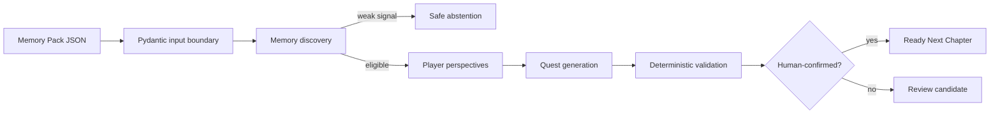

# Phase 1 architecture

## Objective

Prove the AI Memory Engine before building a frontend or integrating live game services. The engine
accepts one versioned Memory Pack and returns one versioned, validated Next Chapter result.



## The input boundary

`MemoryPack` combines four signal groups:

| Signal | Purpose | Examples |
|---|---|---|
| Gameplay | Establish what verifiably happened | revive, retreat ping, vehicle escape |
| Social | Establish who experienced it together | squad members, roles, matches together |
| Human | Establish why a moment may matter | caption, tags, save, reactions, confirmation |
| Current context | Establish why resurfacing may be timely | active members, available mode, trigger |

The schema forbids unknown fields and validates every player and event reference. That makes data
contract drift visible early and prevents later stages from silently accepting malformed context.

## Stage ownership

| Stage | Module | Model-capable? | Deterministic responsibility |
|---|---|---:|---|
| Input | `models/schemas.py` | No | Types, references, consent, schema version |
| Discovery | `agents/memory_agent.py` | Yes | Eligibility score and abstention gate |
| Perspectives | `agents/perspective_agent.py` | Yes | One recall per opted-in member |
| Quest | `agents/quest_agent.py` | Yes | Verifiable objective contract |
| Validation | `agents/validator_agent.py` | No | Evidence, distinctness, safety, confirmation |
| Orchestration | `pipeline.py` | No | Stage order and final status |

The term “agent” means a bounded semantic stage, not an autonomous multi-agent runtime. Each stage
has one job, typed inputs/outputs, and no side effects.

## Provider boundary

Deterministic mode is the evaluation baseline. OpenAI mode replaces semantic generation in the
discovery, perspective, and quest stages; it does not replace input validation, the discovery gate,
or final validation.

```text
same MemoryPack
    ├── deterministic stage implementation ─┐
    └── structured OpenAI stage call ───────┤
                                            v
                                  same Pydantic contracts
                                            v
                               deterministic validator
```

This lets the team compare model quality without changing HTTP payloads or UI assumptions.

## Failure behavior

- Malformed data fails with schema validation errors.
- Low-signal data returns `rejected` with no generated memory, perspective, or quest.
- Strong but unconfirmed data returns `needs_human_confirmation`.
- Unsupported or ungrounded generated content fails deterministic validation and returns `rejected`.
- Confirmed, grounded content returns `ready`.

## Deferred boundaries

Phase 1 does not include databases, authentication, queues, notifications, media analysis, live Free
Fire telemetry, mission-result verification from real matches, or a frontend. Each can be added
behind the current contracts after output quality is demonstrated.

