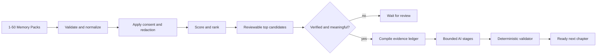

# Phase 1/2 architecture

## Objective

MemoryOS discovers several promising moments from historical Memory Packs, lets a player review one,
and only then generates a grounded memory, teammate perspectives, and a connected quest.



The engine is Python-first. FastAPI and its OpenAPI document are the canonical backend/frontend
contract; a browser or Worker must not implement an independent scoring or validation pipeline.

## Historical discovery

Historical discovery is deterministic. It is cheap enough to run across every submitted pack,
repeatable in tests, and explainable to a player reviewing a candidate. It does not call OpenAI.

Each eligible candidate receives four normalized score components:

| Component | Weight | What it measures |
|---|---:|---|
| Evidence strength | 35% | Specific events and connected gameplay patterns |
| Human signals | 30% | Captions, tags, saves, reactions, and review signals |
| Squad specificity | 20% | How strongly the episode depends on this squad and its roles |
| Reactivation relevance | 15% | Whether resurfacing the memory is timely in the current context |

The four stored components are already weighted. Their sum is both `score_breakdown.total` and
`score`, and the `0.45` eligibility threshold is applied to that unpenalized base score. Duplicate
match IDs then collapse to their strongest candidate. During iterative top-candidate selection, a
repeated memory type receives a `0.08` penalty, reported separately as `diversity_penalty`, and
`ranking_score` becomes `max(score - diversity_penalty, 0)`. Diversity can change selection order,
but cannot make a candidate eligible or ineligible. Remaining ties resolve by newest `played_at`,
then stable `pack_id` order. Offset-aware timestamps are preferred; a legacy timestamp without an
offset is interpreted as UTC so ordering does not depend on the backend host's timezone.

Hard filters run before ranking. A pack cannot surface when it has no grounded events, fewer than
two opted-in squad members, its target player opted out, its source is disputed, or its meaning was
dismissed. Requiring two consenting participants preserves the product's shared-memory premise and
prevents generation of a nominally social quest for one person.

A history request is one consent and identity boundary. Its 1-50 packs must share one squad ID,
target player, roster ID set, and current per-member consent snapshot, and every pack ID must be
unique. New endpoints require explicit consent even for a legacy v1.0 inner pack. This avoids
combining historical snapshots that disagree about who currently permits resurfacing.

## Evidence and privacy boundary

The evidence compiler is the only input-data representation passed to generative stages. It
contains allowed event IDs, event types, actors, targets, locations, timestamps, and sanitized
detail values. Later stages also receive only the preceding typed stage output, never the original
unsanitized Memory Pack.

Before a prompt is assembled:

- Opted-out identities become stable anonymous labels within the request.
- Opted-out players receive no perspective and cannot own a quest objective.
- An important shared event may remain only in anonymized form.
- Opaque pack, squad, match, and event IDs are rejected if they contain an opted-out identity.
- Unknown IDs in typed owners, assignees, and evidence references are rejected.

The validator checks generated facts against this ledger. A valid event ID alone is not enough: its
type, ownership, assignment, and quest verification shape must agree with the source event.
Conservative lexical rules also reject selected unsupported names, locations, numbers, actions,
relationships, emotions, and motives. These rules catch known failure patterns; they are not a
general proof that arbitrary natural language entails only ledger facts. Interpretive language
therefore remains reviewable and must not be presented as measured telemetry.

## Split human trust

One confirmation flag cannot express two different questions. Schema v1.1 separates:

| State | Values | Question answered |
|---|---|---|
| `source_status` | `unreviewed`, `verified`, `disputed` | Did these events actually happen as described? |
| `meaning_status` | `unreviewed`, `confirmed`, `dismissed` | Does this moment matter to the player? |

On the new `/v1/memories/generate` route, AI generation starts only for `verified` + `confirmed`
inputs. Unreviewed candidates remain useful for discovery but cannot become re-engagement content.
Disputed or dismissed candidates are filtered. Legacy v1.0 `confirmed: true` maps to both positive
states; `false` maps to both unreviewed states, with the conversion recorded in response metadata.
The deprecated v1.0 `/discover` route intentionally preserves its older behavior and may create
reviewable drafts before confirmation; new clients must not use it as the Phase 2 trust boundary.

## Stage ownership

| Stage | Model-capable? | Deterministic responsibility |
|---|---:|---|
| Input and normalization | No | Types, cross-references, version compatibility |
| Evidence compiler | No | Consent, redaction, fact ledger |
| Historical ranker | No | Eligibility, scoring, deduplication, diversity |
| Memory discovery | Yes | Bound title/type; render summary/evidence deterministically |
| Perspectives | Yes | Require one exact server-rendered recall per opted-in member |
| Quest | Yes | Bound framing/composition; render objective clauses deterministically |
| Validation | No | Claims, evidence, identity, assignment, review status |
| Orchestration | No | Stage order, provider errors, final status |

“Agent” means a bounded typed stage, not an autonomous multi-agent runtime. Stages have no authority
to bypass an earlier gate or weaken a later validation rule.

## Closed factual rendering

Schema-constrained output is not, by itself, proof that free prose is grounded. MemoryOS therefore
uses deterministic renderers for the core clauses that state gameplay facts:

- The memory summary and evidence references/significance must exactly match the server-rendered
  version for the selected events.
- Each opted-in player's perspective message and evidence references must exactly match the
  player-specific server template.
- Every quest-objective description must exactly match the renderer for its validated metric and
  target.

Live prompts receive these templates and must return them without paraphrasing; exact equality is
checked again before the next stage. The pipeline also replaces model-authored confidence and
confirmation fields with the deterministic signal score and normalized meaning state. The model
still provides bounded framing through memory title and type and quest title, mission, recipe, and
allowed composition. Those fields remain subject to privacy, evidence, action, and conservative
lexical checks. This deliberately narrow prototype boundary can be relaxed only after a stronger
semantic-grounding layer is evaluated.

## Provider boundary

Deterministic mode is the default and the regression baseline. Groq or OpenAI mode may replace the
three semantic stages, but each receives the same sanitized ledger plus the previous typed output and
returns the same Pydantic output types.

```text
sanitized evidence
    |-- deterministic stage implementation --|
    `-- structured live-provider stage call --|--> typed output --> deterministic validator
```

The live adapters use the Responses API with Pydantic Structured Outputs, low reasoning effort, a
30-second timeout, at most two SDK retries, and a 2,000-token output ceiling. OpenAI sets
`store=False`; Groq omits that unsupported field. On a
direct JSON route, a provider failure is reported as a structured HTTP `503`; the service never
silently changes a live request to deterministic prose. Once an NDJSON response has begun, the
equivalent failure is a typed `error` event under HTTP `200`.

## Status and failure behavior

- Invalid schemas, mixed squads, and mixed target players fail with HTTP `422`.
- Ineligible, disputed, dismissed, or validation-failing packs return `rejected`.
- A strong unreviewed candidate returns `needs_source_verification`.
- A verified but unconfirmed candidate returns `needs_meaning_confirmation`.
- Only verified, confirmed, grounded output returns `ready`.
- On direct JSON routes, provider timeouts, refusals, quota failures, and malformed structured
  output return a retryability-aware HTTP `503` response. The NDJSON adapter reports the same fields
  in an HTTP `200` error event because its headers have already been sent.

Response bodies omit `memory` and `next_chapter` when their value is `null`; an empty perspectives
list remains present. A validation failure fails closed by withholding all generated artifacts.
The NDJSON route is a snapshot adapter: after an initial event it runs the same canonical call, then
emits completed previews. It is not token streaming or a live per-stage execution trace. Its
OpenAPI response describes the discriminated schema for one NDJSON line. Client disconnects do not
reliably cancel the synchronous worker thread or an in-flight provider call, so the prototype may
continue work until completion or timeout after its response consumer has gone away.

The top-level result `status` is authoritative for readiness. `validation.passed` can also be true
when deterministic abstention succeeded or when no validation error precedes a human-review gate;
only `status == "ready"` authorizes presentation of generated artifacts as ready.

## Frontend handoff

The frontend should use `/openapi.json` or `/docs` while integrating and derive client types from
that contract. It should display backend scores and reasons, keep the complete selected pack, apply
the player's review decision, and resubmit that pack for generation. It should not recompute
status, consent, ranking, or validation, and a candidate rank or ID is not a generation token.
Review persistence may live in the frontend team's data layer during the prototype, but stored
values must use the v1.1 state semantics above.

The merged `/` player view remains a Phase 1 compatibility client: it calls the deprecated
single-pack route and adds browser-side result guards before rendering. Those guards are useful
defense in depth, but they do not replace backend validation. The `/history` UI provides historical
candidate selection and separate source and meaning actions with types generated from the FastAPI
OpenAPI document.

The Phase 2B `/history` experience is the v1.1 client. Its state machine moves from historical
loading to candidate selection, source review, meaning review, and generation; disputed and
dismissed paths are terminal safe stops. It retains the full selected Memory Pack locally because
a candidate ID, rank, or score is never authorization to generate. Browser requests use same-origin
server proxies, while generated types and a backend snapshot test keep FastAPI as the contract
source of truth.

The consumer-facing AI Memory Inbox uses a separate delivery contract. It automatically chooses a
source-verified candidate, prepares a grounded AI memory and mission while player meaning remains
unreviewed, and returns `pending_player_decision`. A player can accept or decline; `details_wrong`
is a data-quality signal and `not_relevant` is a relevance signal. Neither lets the browser rewrite
telemetry. The older split-review route remains available for internal quality workflows.

## Deferred production boundaries

This phase does not add authentication, durable backend storage, queues, notifications, production
telemetry, regional retention enforcement, cross-request pseudonym management, or real match result
verification. Those require Garena data contracts and privacy review rather than prototype guesses.
